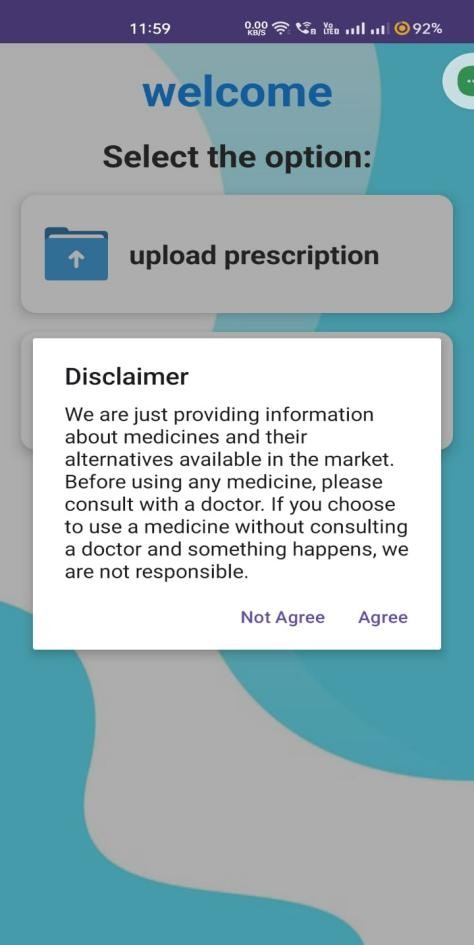
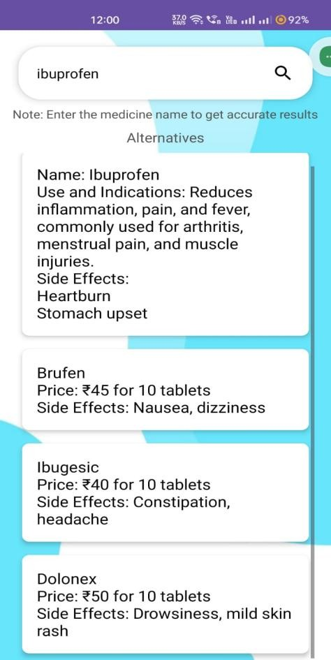
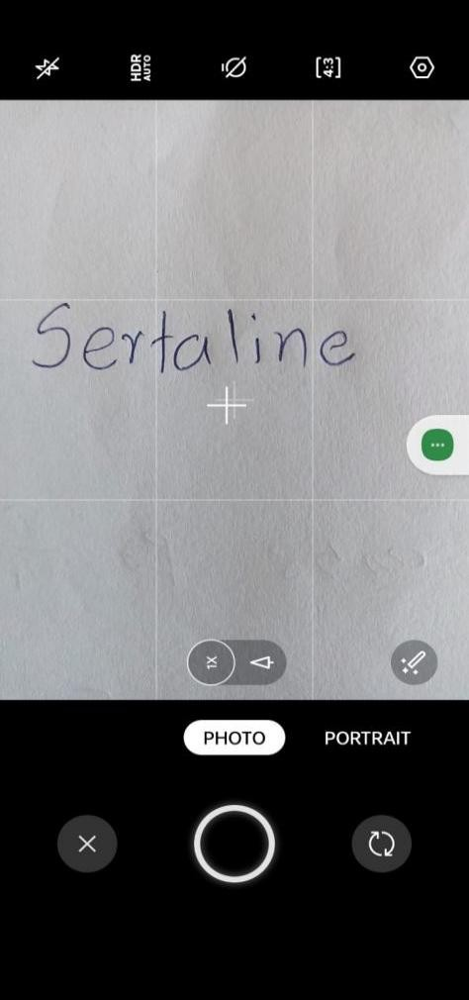

# OCR-Based Android Application for Medicine Alternative Search

## Project Overview

This Android app enables offline medicine alternative searches using typed input (e.g., "Paracetamol") or photo-based OCR. It uses Google’s ML Kit for text recognition and Apache POI to query a local Excel file (`medicine_data.xlsx`), displaying alternatives like "Acetaminophen". Designed for pharmacists and rural users, it operates without internet, ensuring accessibility in low-connectivity areas.

---

## Requirements

| Requirement        | Minimum                         | Maximum                         |
|--------------------|----------------------------------|----------------------------------|
| Android Studio     | Arctic Fox (2020.3.1)            | Latest stable version           |
| JDK                | 11                               | 17                               |
| Android API        | 21 (Lollipop)                    | 34 (Upside Down Cake)           |
| Device Storage     | 100 MB (app + Excel file)        | 500 MB (for larger datasets)    |
| RAM                | 2 GB                             | 8 GB (for optimal performance)  |
| Camera             | 5 MP (for OCR)                   | No upper limit                  |

---

## Installation Process

### Clone the Repository

```bash
git clone https://github.com/[YourGitHubUsername]/OCR-Based-Android-Application-for-Medicine-Alternative-Search.git
cd "Medicine Application"
```
## Screenshots
### 1. Disclaimer Screen


### 2. Search Box with Results


### 3. Camera Capture	



